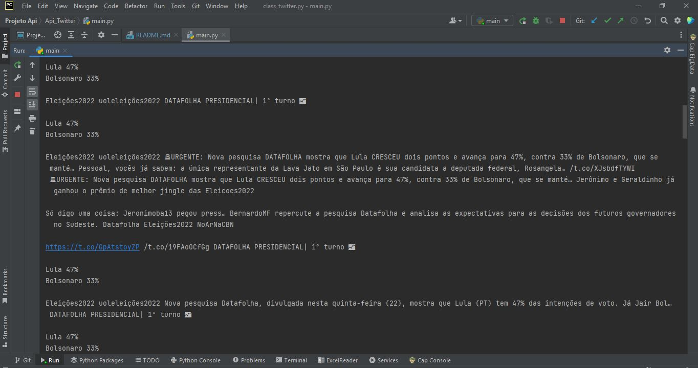
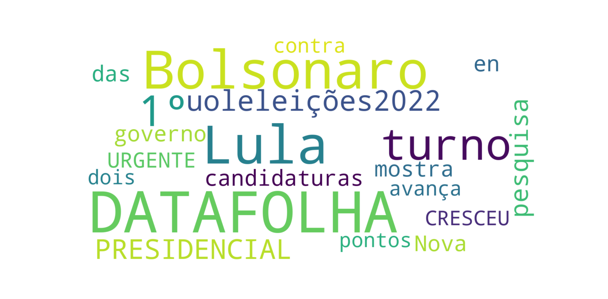

# Data-Extraction-Projects-Via-Twitter-APIs
Data extraction projects via twitter api

### 1 - Projeto Api Twitter

#### Índice

* [Descrição do projeto](#descrio-do-projeto)
* [Status do Projeto](#status-do-projeto)
* [Funcionalidade e demonstração da aplicação](#funcionalidade-e-demonstrao-da-aplicao)
* [Tecnologia utilizadas](#tecnologias-utilizadas)
* [Melhorias Futuras](#melhorias-futuras)
* [Desenvolvedor do projeto](#desenvolvedor-do-projeto)

### Descrição do projeto

Nesse primeiro projeto foi utilizado a API do twitter (tweepy) para buscar dados no twitter. 
Foi criada uma classe tweets onde tem métodos que faz a comunicação com a api,
método que retorna os 100 tweets mais falados no momento sobre o assunto que o
usuário está pesquisando é um método que plota o gráfico wordcloud com as 
nuvens de palavras. 

### Status do projeto

### Funcionalidade e demonstração da aplicação

##### Menu inicial

##### Print dos Tweets encontrado

##### Gráfico Wordcloud sobre eleições do Brasil do ano de 2022

### Tecnologias utilizadas 
* [Python 3.10](https://www.python.org/downloads/) - Linguagem utilizada para criação do projeto.
* [Tweepy](https://www.tweepy.org/) - Api utilizada para realizar a busca dos dados no twitter.
* [Pandas](https://pandas.pydata.org/) - Biblioteca utilizada para colocar os dados retornado da api do twitter em um dataframe pandas e fazer sua manipulação.
* [Wordcloud](https://pypi.org/project/wordcloud/) - Biblioteca utilizada para plotagem do gráfico de palavras.
* [Matplotlib](https://matplotlib.org/) - Biblioteca utilizada para plotagem do gráfico de palavras.

### Melhorias Futuras
- [ ] Adicionar possibilidade do usuário digitar a data que deseja visualizar tweets anteriores
- [ ] Pesquisar tweets por países ou cidade específicas 

### Desenvolvedor do projeto
[ Vitor Souza ](https://github.com/vitorhssouza) 

 
 

